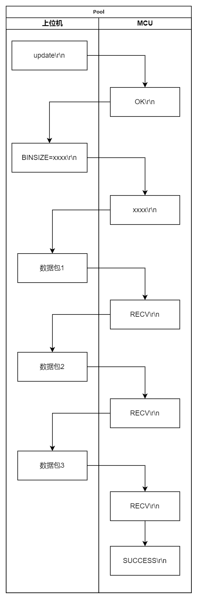

# mBoot

## 简介

mBoot 是一个轻量级、基于UART、适用于Cortex-M系列MCU的Bootloader，抽象出硬件驱动接口，易于移植。搭配 [mBootTool](https://github.com/jiexunzh/mBootTool) 上位机可实现MCU固件升级。

## mBoot 特点

- 资源占用低，Bootloader完整功能仅需10KB Flash（GD32C113、AC6编译器、-O2优化等级）
- 抽象出mBoot所需的外设驱动接口，只需根据具体硬件修改接口文件和配置文件即可使用
- 可靠的固件传输机制，固件分包传输，带多种校验，具有超时判断、出错重传、错误告知等功能
- 代码清晰、模块化、松耦合，易于修改和拓展
- 易于现有App适配集成，搭配“Bootloader上电监听”功能，轻量版App只需设置中断向量偏移即可

## 项目目录

```
mBoot/
├── Docs/                  # 说明文档、配图
├── Examples/              # 示例工程（例如 GD32C113、GD32F407 等）
├── mBoot/                 # mBoot 源码
├── .gitignore/            # git 忽略文件
├── Doxyfile/              # Doxygen 配置文件
├── README.md/             # 项目说明
```

### mBoot 源码目录

| 名称             | 描述              |
| ---------------- | ----------------- |
| mBoot_app_full   | 完整版App示例代码 |
| mBoot_app_lite   | 轻量版App示例代码 |
| mBoot_bootloader | mBoot 源码        |
| mBoot_config.h   | mBoot 配置文件    |

## 使用方法

### Bootloader 移植

1、新建目录：在一个最小MCU工程中新建 `mBoot` 目录；将 `mBoot_bootloader` 的 `Inc` 和 `Src` 复制到 `mBoot` 目录；将 `main.c` 、 `mBoot_config.h`  复制到 `App` 目录。

2、修改 `mBoot_config.h` ：根据不同芯片的Flash扇区划分，修改地址分区；根据实际情况，修改相应宏开关。

3、修改 `mBoot_port.c/h` ：根据提示信息编写硬件驱动，并填入到对应接口函数

### App 适配

#### App lite

- 仅需修改”IROM1“并配置与 `mBoot_config.h` 一致的中断向量偏移即可

- 前提条件：必须开启”Bootloader上电监听“功能，在点击上位机”固件升级“按钮后，手动将MCU重新上电即可进行固件升级

#### App full

- 修改”IROM1“并配置与 `mBoot_config.h` 一致的中断向量偏移
- 提供UART收发、Flash写Flag驱动
- 适配 `mBoot_app_handle(cmd_buf)` 或自定义触发App升级跳转命令

## 固件升级协议

### 整体思路

上位机将BIN文件拆成若干个固定大小的数据包，告知MCU固件包大小，MCU逐包接收、校验、写入Flash，然后响应可以继续接收下一个数据包。

### 固件数据包结构

| 帧头 | 包序号 | 有效数据    | CRC16-CCITT |
| ---- | ------ | ----------- | ----------- |
| 0xA5 | 0~255  | BIN文件内容 | 低字节在前  |

- 帧头（1B）：0xA5
- 包序号（1B）：从0开始递增，目前只用了1个字节，最大可传输256KB固件
- 有效数据（1024B）：数据包，目前固定大小为1KB，若最后一个数据包的长度不足1KB，无效数据以**0xFF**填充（易于MCU整包写入Flash）。
- CRC16-CCITT（2B）：多项式固定为 0x1021，初始值为 0xFFFF，CRC 低字节在前

### 固件升级流程


### 上位机与MCU数据交互流程



## Flash 划分示例

整体将MCU Flash划分为Bootloader区、共享区和应用程序区，共享区用来存储mBoot状态标志，以及其他需要存储或备份的用户数据。

### GD32C113

GD32C113和STM32F103一样，Flash的最小擦除单位是1KB大小的页，GD32C113示例工程的Flash划分如下：


### GD32F407

GD32F407的Flash最小擦除单位是扇区，前面4个扇区每个是16KB，第5个扇区是64KB，往后的扇区是128KB，GD32F407示例工程的Flash划分如下：


